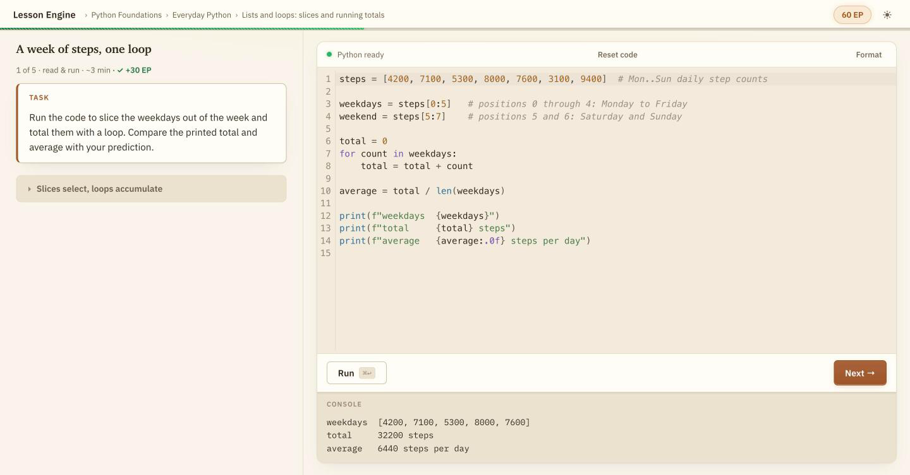

# Lesson Engine

A local-first engine for practice-first coding lessons: a short page of prose
beside a real editor, the learner's Python running in the browser via
[Pyodide](https://pyodide.org/), and graders that inspect the result. No
platform, no account, no server-side execution — it serves your own machine.

<picture>
  <source media="(prefers-color-scheme: dark)" srcset="docs/screenshot-dark.png">
  
</picture>

Interactive coding platforms are hosted. That's fine for public courses and
wrong for private material: internal training on proprietary libraries, a
subject you want to teach your way, or practice that shouldn't depend on
someone else's uptime. Here, content is a flat directory of markdown and YAML
you can version, diff, and review in a PR; learner progress is a JSON file in
your home directory; and nothing you write or type is sent anywhere.

**Nothing loads from a CDN.** The Python interpreter, its WebAssembly, the
standard library, and every package wheel are vendored into the app at install
time and served from your own origin, so a learner's browser never fetches
executable code from a third party, and the whole thing keeps working behind a
strict firewall or on a plane. The one optional exception is opt-in and yours
to enable: the AI check, which calls the Anthropic API only for lessons that
declare it.

Content is organized Path > Course > Unit > Lesson, and adding, removing, or
reordering lessons never requires an engine change. Practice comes in five
types that fade support one notch at a time:

| type | the learner… |
|---|---|
| `read_run` | reads a worked example and runs it |
| `explore` | varies a working program and observes what changes |
| `debug` | fixes a broken program |
| `complete` | fills in the missing part of a partial solution |
| `write` | writes the solution from scratch |

The design follows what the research on skill acquisition keeps finding: people
learn by retrieving and doing, not by rereading. So prose is minimal, every
lesson asks for code within the first minute, and worked examples come before
independent problem-solving, with support fading across the five types.
Progression is mastery-flavored: a lesson completes when its checks pass,
completed lessons earn EP, and per-lesson progress means you always resume
where the work is.

Good fits: turning a subject you know into runnable practice, internal
engineering onboarding (learner code executes in the learner's own browser,
never on a server), or a personal drill bench with built-in checks.

## Quickstart

```sh
npm install
npm run dev
```

Open http://localhost:5173. Installing vendors the Python runtime into
`public/pyodide/` (about 16 MB, from the pinned `pyodide` npm package), and
first run seeds your data directory (`~/.lesson-engine`) from the repo's
`examples/content/`, a small starter path that teaches Python fundamentals
through all five practice types. So there's a lesson to open immediately, and
it runs offline from here on.

The only requirement is Node >= 20.11. Python is not needed to build, test, or
run the engine — learner code runs in the browser.

For a production build, `npm run build` (vendor + typecheck + bundle) then
`npm start` serves the built app at http://localhost:4173 with the same API
routes.

### Lessons that import packages

The default vendor step covers pure-Python content. If your lessons declare
`packages`, fetch those wheels once:

```sh
npm run vendor:pyodide -- numpy matplotlib   # or --all for every allowlisted one
```

They're downloaded from the pinned Pyodide release and checked against the
sha256 in its lockfile, then served from your origin like everything else.
They're kept out of the default install because they're large: numpy is 11 MB,
matplotlib 15 MB, sympy 15 MB, and scipy 45 MB. Anything vendored is
gitignored, so `npm run vendor:pyodide` is how you rebuild it, not git.

## Where content lives

All content sits in a data directory outside the repo: `$LESSON_ENGINE_DATA_DIR`
if set, otherwise `~/.lesson-engine`.

```
<data-dir>/
  progress.json               # learner progress (see below)
  content/
    config.yaml               # app title, EP, timeouts, Pyodide version
    paths.yaml                # which paths the shelf shows, in order
    paths/<path-id>/
      manifest.yaml           # the path's course/unit/lesson tree
      lessons/<lesson-id>/
        lesson.md             # prose + starter code
        grade.py              # checks
```

Both run modes (dev and built) serve `/content/*` from this directory. First
run seeds it from `examples/content/`; after that the engine never touches
`content/`, so edit freely.

Learner progress lives in `<data-dir>/progress.json`, mirrored from the
browser's localStorage. Writes are atomic, and a corrupt file is backed up
rather than deleted.

## Authoring a lesson by hand

A lesson is a directory holding two files.

`lesson.md` is YAML frontmatter, markdown prose, and exactly one
` ```python starter ` fence:

````markdown
---
id: slicing-basics
title: Slicing a list
type: write
---

A slice `xs[a:b]` takes elements from index `a` up to but not including `b`.

Write `middle(xs)` returning `xs` without its first and last elements.

```python starter
def middle(xs):
    ...
```
````

Frontmatter keys: `id` (kebab-case, matching the directory name), `title`,
`type` (one of the five), plus optional `packages` (extra Pyodide packages
from `numpy`, `scipy`, `sympy`, `matplotlib`), `predict` (a
predict-before-you-run prompt), `entry_point` (the function name, for `write`
lessons graded through a function), `est_minutes` (overrides the per-type
estimate from config.yaml), `tags` (freeform labels, not yet surfaced in the
UI), and `grading` (the optional AI check, below). Prose supports KaTeX math,
` ```mermaid ` diagrams, and images.

`grade.py` defines `CHECKS`, a list of dicts run against the learner's
namespace in Pyodide after their code executes:

```python
CHECKS = [
    {
        "name": "middle drops both ends",
        "fn": lambda ns: ns["middle"]([1, 2, 3, 4]) == [2, 3],
        "message": "middle([1, 2, 3, 4]) should keep only the inner elements.",
        "hidden": False,
    },
]
```

Grader rules:

- The engine injects two helpers: `_close(a, b, tol=1e-9)` for float
  comparison and `_raises(fn, *args, exc=ValueError)` for must-raise checks.
- Never test results with `is True` / `is False`; numpy code returns
  `numpy.bool_`. Wrap in `bool(...)`.
- `message` shows on failure. Write it as a hint toward the fix, never a bare
  "wrong", and never the answer itself.
- `"hidden": True` redacts a check's name and message in the results list, for
  checks whose text would give the answer away.
- `explore` lessons pin their fixed scenario variables with a visible
  `scenario_pinned` check, so an edited parameter can't make the grade
  contradict the printed output.
- `read_run` lessons use `CHECKS = []`; running is the practice.

Then list the lesson id in the path's `manifest.yaml`, and the path id in
`paths.yaml`. Array order is presentation order, and ids only need to be
unique within their path. `npm run validate` checks the whole data directory
for structure and referential integrity.

### The optional AI check

Deterministic checks own everything they can express. For requirements they
can't (structure, style, code that can't be executed on its own), frontmatter
may declare an AI check:

```yaml
grading:
  ai:
    mode: augment      # or replace
    criteria: The function must use a list comprehension, not a loop.
```

This needs an Anthropic API key: `cp .env.example .env` and set
`ANTHROPIC_API_KEY`. Without one the engine degrades gracefully — `augment`
lessons are accepted on their deterministic checks alone, and `replace`
lessons report the grader as unavailable and can be retried later.

## Authoring with the bundled skills

For authoring at scale, the repo ships Claude Code skills in
`.claude/skills/`. `path-build` orchestrates four layer skills
(`course-design`, `unit-design`, `lesson-write`, `lesson-review`) to generate
a whole path from source material you trust, with an advisory QA checkpoint
before content ships. If you use Claude Code, this is the recommended route
for anything bigger than a couple of lessons; hand-authoring is fully
supported either way.

## Configuration

Environment variables (each may also live in `.env`):

| variable | meaning |
|---|---|
| `LESSON_ENGINE_DATA_DIR` | overrides the data directory (default `~/.lesson-engine`) |
| `ANTHROPIC_API_KEY` | credential for the optional AI check — the only secret |
| `ANTHROPIC_AUTH_TOKEN` | accepted instead of the API key (bearer-token setups) |
| `GRADER_MODEL` | model for the AI check (default `claude-opus-4-8`) |
| `PORT` | port for `npm start` (default `4173`) |

`<data-dir>/content/config.yaml` holds the engine-global settings:

| key | meaning |
|---|---|
| `app_title` | name shown in the top bar |
| `ep_per_lesson` | EP awarded per completed lesson |
| `est_minutes_by_type` | estimated minutes for each of the five lesson types |
| `default_packages` | Pyodide packages loaded for every lesson (vendor them first) |
| `run_timeout_ms` | wall-clock limit for a Run |

The Python version isn't a content setting: it's pinned by the `pyodide`
dependency in `package.json` and vendored from there.

`.env` is optional, and only the credential is a secret — nothing else in
the engine needs one, and none is needed at all unless your content declares
AI grading.

## Architecture

- `src/schemas.ts` — zod schemas for every data shape, shared by the runtime,
  the validator, and the server
- `src/py/` — the Pyodide web worker: in-browser Python setup, run and grade
  snippets
- `src/grading.ts` — the grading pipeline: run, deterministic checks, optional
  AI verdict, one result
- `server/` — Hono server: serves the built app, the content directory, the
  `/api/grade` grader route, and the `/api/progress` store
- `scripts/validate.ts` — structural validator for a content directory
- `scripts/vendor-pyodide.mjs` — vendors the Python runtime so nothing loads
  from a CDN

## Development

```sh
npm run dev              # Vite + HMR at http://localhost:5173, all API routes included
npm test                 # validates examples/content, then runs the Vitest suite
npm run build            # vendor + typecheck + bundle
npm run validate         # structural check of your data-dir content (authoring aid)
npm run vendor:pyodide   # re-vendor the Python runtime (add package names as needed)
```

Build and test are self-contained: they need no lesson content outside the
repo and no Python install.

## License

MIT — see [LICENSE](LICENSE).
