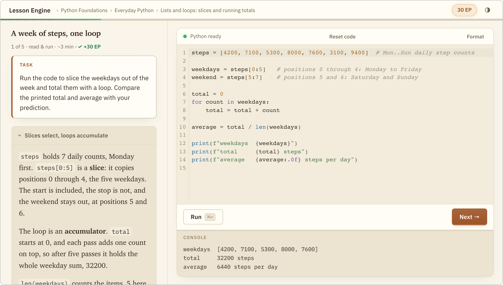
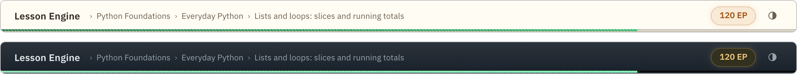
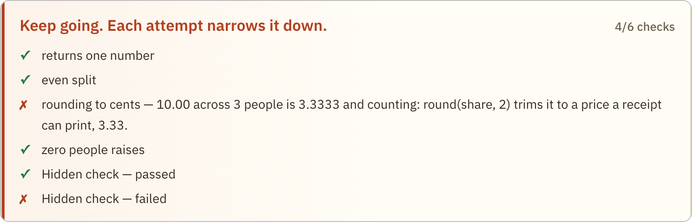

# Lesson Engine

[](https://github.com/matt-w-horn/lesson-engine/actions/workflows/ci.yml)


Lesson Engine is a local web app for teaching yourself (or your team) Python
through short, auto-graded lessons that you author as plain Markdown and YAML
files. A lesson is a short page of prose beside a real editor: read a
little, write Python, run it, see which checks pass. The Python is
WebAssembly ([Pyodide](https://pyodide.org/)) running in your own browser,
so nothing you type is executed on a server. No account, no telemetry; the
one network feature, an opt-in AI check, is [below](#the-optional-ai-check).

<p align="center">
  
  <br>
  <sub>The bundled starter path, one Run in. Explanation on the left; the editor and console are where the time goes.</sub>
</p>

This engine is for material that can't go on a hosted learning platform:
onboarding for a proprietary codebase, a subject you want taught your way,
your own interview drilling. It is single-learner, local, and Python-only by
design (another language would mean replacing the Pyodide worker). Lessons
are plain files you can diff and review in a PR, and progress is one JSON
file in your home directory.

## Quickstart

```sh
git clone https://github.com/matt-w-horn/lesson-engine
cd lesson-engine
npm install
npm run dev
```

Open http://localhost:5173 and the starter path is on screen: Python
fundamentals, taught through all five practice types. `npm install` vendors
the Python runtime into the app (about 16 MB), and first run seeds your data
directory (`~/.lesson-engine`) from the repo's `examples/content/`. After that
it works on a plane.

Node 20.11 or newer is the only requirement. Python itself isn't needed; the
workbench brings its own.

For a production build, `npm run build` then `npm start` serves the app at
http://localhost:4173 with the same API routes.

## How lessons teach

Content is organized Path > Course > Unit > Lesson. Within a unit, practice
comes in five types that fade support one notch at a time, worked example
first, blank editor last:

| type | the learner… |
|---|---|
| `read_run` | reads a worked example and runs it |
| `explore` | varies a working program and observes what changes |
| `debug` | fixes a broken program |
| `complete` | fills in the missing part of a partial solution |
| `write` | writes the solution from scratch |

The ladder leans on two old findings from learning research, the
[testing effect](https://en.wikipedia.org/wiki/Testing_effect) and the
[worked-example effect](https://en.wikipedia.org/wiki/Worked-example_effect):
retrieval beats rereading, and studying a solved problem beats flailing at an
unsolved one. So prose stays short,
every lesson asks for code within the first minute, and a lesson completes
only when its checks pass.

Completing lessons earns EP (experience points), and the thin bar under the
toolbar fills as the unit progresses, lesson by lesson. There are day and
night themes; each keeps the editor front and center.



## Your content

Everything you author lives outside the repo, in a data directory:
`$LESSON_ENGINE_DATA_DIR` if set, otherwise `~/.lesson-engine`.

```
<data-dir>/
  progress.json               # learner progress
  content/
    config.yaml               # app title, EP, timeouts
    paths.yaml                # which paths the shelf shows, in order
    paths/<path-id>/
      manifest.yaml           # the path's course/unit/lesson tree
      lessons/<lesson-id>/
        lesson.md             # prose + starter code
        grade.py              # checks
```

Both run modes serve content from this directory, and the engine never touches
it after the first-run seed. Adding, removing, or reordering lessons is a data
change; no engine code is involved. `npm run validate` checks the whole
directory for structure and for broken references (every lesson id a manifest
names must exist).

Progress writes are atomic, and a corrupt `progress.json` is backed up rather
than deleted.

### A lesson is two files

`lesson.md` is YAML frontmatter, markdown prose, and exactly one
` ```python starter ` fence:

````markdown
---
id: slicing-basics
title: Slicing a list
type: write
---

A slice `xs[a:b]` takes elements from index `a` up to but not including `b`.

Write `middle(xs)` returning `xs` without its first and last elements.

```python starter
def middle(xs):
    ...
```
````

Beyond `id`, `title`, and `type`, frontmatter can declare `packages` (Pyodide
packages the lesson imports — vendor them first, [below](#nothing-loads-from-a-cdn)), `predict` (a predict-before-you-run prompt),
`entry_point`, `est_minutes`, `tags`, and `grading` (the optional AI check,
below). Prose supports KaTeX math, ` ```mermaid ` diagrams, and images.

`grade.py` defines `CHECKS`, a list run against the learner's namespace after
their code executes:

```python
CHECKS = [
    {
        "name": "middle drops both ends",
        "fn": lambda ns: ns["middle"]([1, 2, 3, 4]) == [2, 3],
        "message": "middle([1, 2, 3, 4]) should keep only the inner elements.",
        "hidden": False,
    },
]
```

`message` shows on failure. Write it as a hint toward the fix, never a bare
"wrong" and never the answer. `"hidden": True` redacts a check's name and
message for checks whose text would give the solution away. Here is what the
learner sees when an attempt comes up short:

<p align="center">
  
</p>

Two helpers are injected for graders: `_close(a, b)` for float comparison and
`_raises(fn, *args, exc=ValueError)` for must-raise checks. `read_run` lessons
use `CHECKS = []`; running is the practice.

New lessons go live by listing the lesson id in the path's `manifest.yaml`.
Array order is presentation order.

### The optional AI check

Deterministic checks (plain Python: same submission, same verdict) own
everything they can express. For requirements they can't (structure, style,
"must use a comprehension"), frontmatter may declare an AI check:

```yaml
grading:
  ai:
    mode: augment      # or replace
    criteria: The function must use a list comprehension, not a loop.
```

> [!NOTE]
> This is the engine's only network feature, and it is opt-in per lesson; the
> bundled starter path doesn't use it. For lessons that declare it, the
> learner's submission is sent to the Anthropic API for a verdict (one API
> call per graded submission), which
> needs a key (`cp .env.example .env`, set `ANTHROPIC_API_KEY`). Without one,
> `augment` lessons pass on their deterministic checks alone and `replace`
> lessons report the grader as unavailable; everything else is untouched.

### Authoring at scale

Everything above is hand-authoring, and it's the primary path. For bulk work
the repo ships Claude Code skills in `.claude/skills/` (`path-build` walks
course design, unit design, lesson writing, and review against source
material you supply), but they produce the same two files per lesson, and
nothing in the engine knows or cares how a lesson was written.

## Nothing loads from a CDN

The Python interpreter, its WebAssembly, the standard library, and every
package wheel are vendored into the app at install time and served from your
own origin. A learner's browser never fetches executable code from a third
party, and the whole thing keeps working behind a strict firewall.

The default vendor step covers pure-Python lessons. If your content declares
`packages`, fetch those wheels once:

```sh
npm run vendor:pyodide -- numpy matplotlib   # or --all for every allowlisted one
```

Wheels come from the pinned Pyodide release and are verified against the
sha256 in its lockfile. They stay out of the default install because they're
large: numpy is 11 MB, scipy 45 MB. Vendored files are gitignored;
`npm run vendor:pyodide` is how you rebuild them, not git.

## Configuration

Environment variables (each may also live in `.env`):

| variable | meaning |
|---|---|
| `LESSON_ENGINE_DATA_DIR` | overrides the data directory (default `~/.lesson-engine`) |
| `ANTHROPIC_API_KEY` | credential for the optional AI check — the only secret |
| `ANTHROPIC_AUTH_TOKEN` | accepted instead of the API key (bearer-token setups) |
| `GRADER_MODEL` | model for the AI check (default `claude-opus-4-8`) |
| `PORT` | port for `npm start` (default `4173`) |

`<data-dir>/content/config.yaml` holds the engine-global settings:

| key | meaning |
|---|---|
| `app_title` | name shown in the top bar |
| `ep_per_lesson` | EP awarded per completed lesson |
| `est_minutes_by_type` | estimated minutes for each of the five lesson types |
| `default_packages` | Pyodide packages loaded for every lesson (vendor them first) |
| `run_timeout_ms` | wall-clock limit for a Run |

The Python version is pinned by the `pyodide` dependency in `package.json`
and vendored from there; it is not a content setting.

## Development

```sh
npm run dev              # Vite + HMR at http://localhost:5173, all API routes included
npm test                 # validates examples/content, then runs the Vitest suite
npm run build            # vendor + typecheck + bundle
npm run validate         # structural check of your data-dir content (authoring aid)
npm run vendor:pyodide   # re-vendor the Python runtime (add package names as needed)
```

Build and test are self-contained: no lesson content outside the repo, no
Python install. A Makefile wraps build-and-serve for local convenience
(`make help` lists targets; the `url` target is macOS/Caddy-specific).

The map, if you're reading the source:

- `src/schemas.ts` — zod schemas for every data shape, shared by the runtime,
  the validator, and the server
- `src/py/` — the Pyodide web worker: in-browser Python, run and grade snippets
- `src/grading.ts` — the grading pipeline: run, deterministic checks, optional
  AI verdict, one result
- `server/` — Hono server: the built app, the content directory, the grader
  and progress APIs
- `scripts/vendor-pyodide.mjs` — vendors the Python runtime so nothing loads
  from a CDN

## License

MIT — see [LICENSE](LICENSE). Security reports go through GitHub's private
vulnerability reporting; see [SECURITY.md](SECURITY.md).
